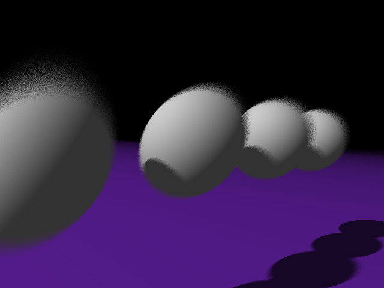
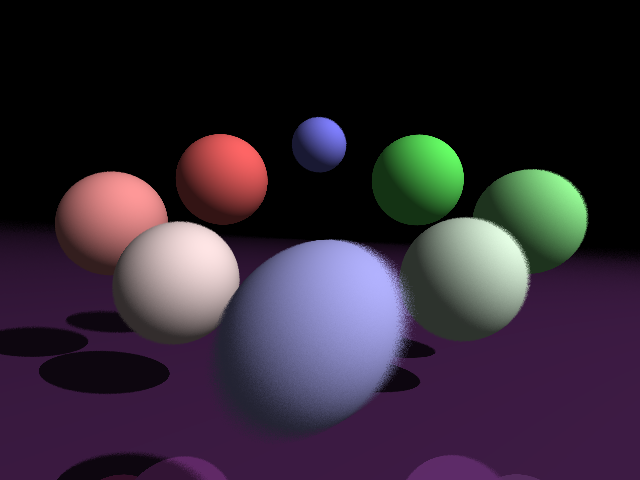
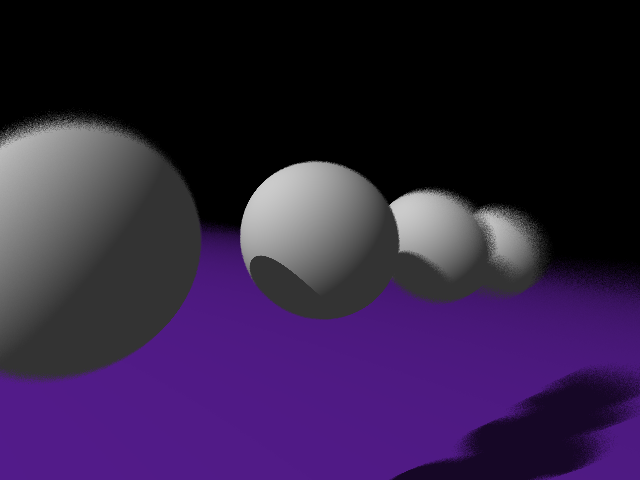
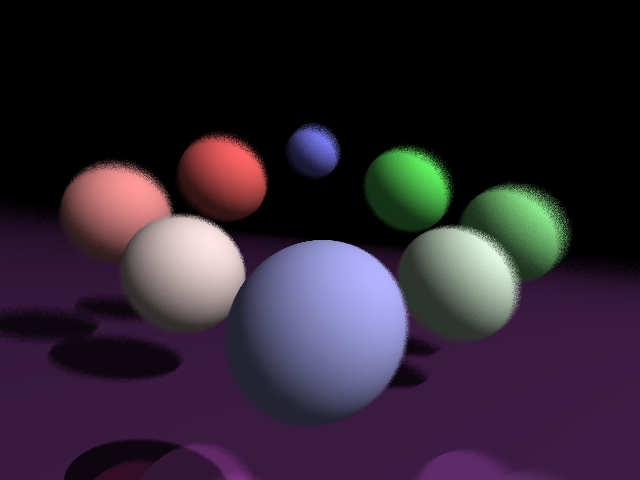

# Final Project - Depth of Field

Depth of Field Implementation

I chose to add a depth of field feature to my raytracer because I wanted my scene to look more realistic and I wanted the camera to have actual camera-like features. In real life, objects are blurred when they are not in focus. Implementing depth of field mimics the focus of a camera lens. 

Resources:
http://ray-tracing-conept.blogspot.com/2015/01/depth-of-field.html

https://steveharveynz.wordpress.com/2012/12/21/ray-tracer-part-5-depth-of-field/

Explanation/Description:

To implement depth of field, we assume the camera is of a certain size and has a certain focal length. In order to create a blurred effect, we must cast multiple rays coming from random locations in our camera lens. This is also called "jittering" the location of ray/camera. We then take the average color generated from the rays to compute the pixel color.

In my raytracer, I assumed the camera had a radius of 1.0 and cast 16 rays to generate each pixel color.

The following images were generated using a focal length of 15:

The same images, now with focal lengths of 5 (top) and 7 (bottom):

Websites:
https://calpoly-csc473-spring-18.github.io/final-project-website-vanessalicia8/
https://www.dropbox.com/sh/xxqic6u095ba3v3/AABbZ5qJ0R4chm9WZ58I8MtNa?dl=0
